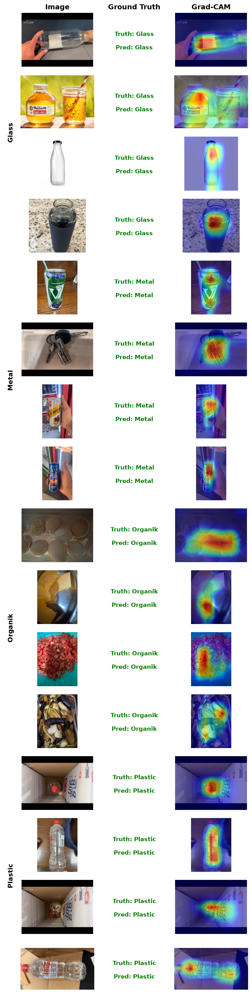

# 🌿 Premium Sortify — Smart Campus Waste Sorting System with EcoGuide AI

Premium Sortify is an AI-powered smart waste management system. It combines a computer-vision-driven smart bin, a gamified student mobile app, and **EcoGuide AI** — a bilingual (Arabic/English) conversational assistant — to classify waste in real time and spread sustainability awareness on campus.

---

## 🧠 What This Repo Demonstrates

This repo contains the **AI/ML core** of the project — the pieces that turn a mechanical bin into an intelligent system:

| Component | What it does |
|---|---|
| **Intent Classifier** | Fine-tuned XLM-RoBERTa model that understands what a user is asking (bilingual, code-switch aware) |
| **Guardrail System** | Confidence/margin thresholds, negation detection, short-query handling, and relevance gating to keep the chatbot honest |
| **RAG Pipeline** | Dual FAISS retrieval (project-specific + general sustainability knowledge) fused with Reciprocal Rank Fusion |
| **EcoGuide AI Chatbot** | Qwen2.5-7B-Instruct generation layer with strict bilingual response enforcement, served locally via Gradio |
| **Waste Vision Classifier** | ResNet50 model (benchmarked against 3 other architectures) sorting items into Glass / Metal / Organic / Plastic in real time on the physical bin |
| **Explainable AI (Grad-CAM)** | Visual heatmaps validating the classifier attends to the actual waste item, not background artifacts, before deployment |

---

## 🏗️ System Architecture

```
                     ┌─────────────────────────┐
                     │        Smart Bin          │
                     │  IR sensor detects a       │
                     │  waste item dumped in       │
                     │  the bin                    │
                     └────────────┬─────────────┘
                                  ▼
                     ┌─────────────────────────┐
                     │   Webcam Application      │
                     │  captures an image of      │
                     │  the item                  │
                     └────────────┬─────────────┘
                                  ▼
                     ┌─────────────────────────┐
                     │   ResNet50 Classifier     │
                     │  Glass / Metal / Organic /│
                     │  Plastic                  │
                     └────────────┬─────────────┘
                                  ▼
                     ┌─────────────────────────┐
                     │   PySerial → Arduino      │
                     │  sends classification      │
                     │  result over serial        │
                     └────────────┬─────────────┘
                                  ▼
                     ┌─────────────────────────┐
                     │   Servo Motor             │
                     │  rotates to the correct    │
                     │  bucket                    │
                     └─────────────────────────┘

┌───────────────────────────────────────────────────────────┐
│                      EcoGuide AI (this repo)                 │
│                                                               │
│  User Query (EN/AR/mixed)                                    │
│        │                                                      │
│        ▼                                                      │
│  Text Normalization  (unicode, Arabic diacritics, dialects)  │
│        │                                                      │
│        ▼                                                      │
│  Intent Classifier (XLM-RoBERTa-base, 8 intents)              │
│        │                                                      │
│        ▼                                                      │
│  Guardrails  (confidence/margin, negation, short-text)        │
│        │  pass                    │ fail                      │
│        ▼                          ▼                            │
│  Route → FAISS Retrieval    Bilingual clarification/fallback  │
│  (project index + general   │
│   index, RRF fusion)        │
│        │                    │
│        ▼                    │
│  Qwen2.5-7B-Instruct  ◄──────┘
│  (bilingual generation, cited sources)
│        │
│        ▼
│  Gradio Chat UI (local, GPU-only, no external API)
└───────────────────────────────────────────────────────────┘
```

---

## 🤖 EcoGuide AI — Chatbot Core

### 1. Intent Classification
- **Model:** `xlm-roberta-base`, fine-tuned for sequence classification
- **Dataset:** 2,896 labeled bilingual samples across **8 intents**: `project_information`, `out_of_scope`, `sustainability_definition`, `waste_sorting`, `recycle_plastic`, `recycle_metal`, `recycle_glass`, `recycle_organic`
- **Training:** Class-weighted loss (inverse frequency) to handle imbalance, 15 epochs, stratified 80/20 split
- **Result:** **95.0% F1-macro / 94.8% accuracy** on held-out validation
- Text normalization pipeline handles Arabic diacritics (tashkeel), letter-variant unification (أ/إ/آ → ا, ة → ه), and mixed-language input

### 2. Guardrail System
Because a chatbot for a physical sorting system needs to *know when it doesn't know*, EcoGuide AI layers several safety checks on top of the raw classifier:
- **Confidence & margin thresholds** — low-certainty predictions trigger a bilingual clarification prompt instead of a guess
- **Negation detection** — flags mismatches like *"this is NOT plastic"* being misrouted to a plastic-recycling answer (EN + Arabic dialectal negation: مش / موش / بدون / من غير)
- **Short-query handling** — 1–2 word queries get a clarifying follow-up rather than a low-confidence answer
- **Post-retrieval relevance gating** — if retrieved knowledge-base chunks don't clear a relevance threshold, the bot falls back to an honest "I don't have that information" response (bilingual)
- **Temperature-scaled softmax** — reduces classifier overconfidence for more calibrated guardrail triggers

### 3. Retrieval-Augmented Generation (RAG)
- **Embeddings:** `intfloat/multilingual-e5-base`
- **Vector store:** Two separate FAISS indexes — a **project-specific** knowledge base (Premium Sortify docs, team info, competition materials) and a **general** sustainability/recycling reference — merged via **Reciprocal Rank Fusion (RRF)** when a query needs both
- **Generation:** `Qwen/Qwen2.5-7B-Instruct` with strict language-matching instructions (Arabic query → Arabic-only answer, and vice versa), source citations returned with every answer
- **Deployment:** Fully local via Gradio (GPU-only, bfloat16, no external API calls)

### 4. Rigorous Adversarial Testing
Beyond standard validation accuracy, the classifier and guardrails were stress-tested against a **custom-built adversarial test suite (200+ hand-crafted edge cases)** covering:
- Dialectal Arabic (Egyptian, Gulf, Levantine, Maghrebi)
- Code-switching / mixed EN-AR sentences
- Explicit, implicit, and double negation
- Typos, phonetic spellings, and unusual formatting (brackets, dots, quotes)
- Compound items and material ambiguity (e.g., "milk carton," "tetra pak")
- Semantic traps (e.g., "glass ceiling," "metal gear solid," "plastic surgery")

This adversarial suite was used iteratively to identify guardrail blind spots (e.g., implicit negation like *"without metal parts"*, or homoglyph substring traps like "no" inside "nothing") and prioritize fixes — a practice closer to production ML robustness testing than typical student-project validation.

---

## 👁️ Waste Vision Classifier (Physical Bin)

### Model Selection — Benchmarked, Not Assumed
Four architectures were fine-tuned and compared head-to-head on identical data, splits, and hardware (RTX 5090 Laptop GPU, 10 epochs, AdamW + cosine LR schedule, bf16 mixed precision):

| Model | Test Accuracy | Train Time |
|---|---|---|
| ConvNeXt-Tiny | 95.99% | 6.7 min |
| **ResNet50 (chosen)** | **95.88%** | **6.6 min** |
| EfficientNet-B0 | 92.34% | 7.0 min |
| MobileNetV3-Large | 91.97% | 6.6 min |

**ResNet50 was selected for deployment**: it matched the top-performing ConvNeXt-Tiny within 0.1 points of accuracy, while being a far more established, better-optimized architecture for fast, low-latency inference on embedded/edge hardware — the deciding factor for a physical bin that needs a real-time response on every deposit, not just the highest benchmark number.

**Final ResNet50 performance** (750-image held-out test set):
- **95.9% accuracy, 0.960 F1-macro**
- Per-class F1: Glass 0.957 · Metal 0.960 · Organic 0.988 · Plastic 0.936 (plastic is the hardest class — consistent with it being the most visually varied category)

### Training Approach
- **Transfer learning:** ImageNet-pretrained ResNet50, backbone frozen except `layer3`/`layer4`, with a custom classification head (Dropout → FC(512) → ReLU → FC(4))
- **Augmentation:** RandomResizedCrop, RandomHorizontalFlip, TrivialAugmentWide
- **Optimization:** AdamW, cosine-annealed learning rate, bf16 automatic mixed precision, `channels_last` memory format for GPU throughput

### Explainable AI (XAI) — Grad-CAM
Accuracy alone doesn't prove a model is looking at the right thing — it could be keying off background, lighting, or a hand in the frame instead of the waste item itself. To validate this before trusting the model with a physical, automated sorting decision, **Grad-CAM** was used to generate visual heatmaps showing exactly which pixels drove each prediction, sampled across all 4 classes:



In every sampled case, the heatmap concentrates on the object itself (the bottle body, the can, the food waste, the plastic bottle) rather than the hand, background, or table — evidence that the model learned genuine material/shape features instead of shortcut correlations in the dataset. This was used as a pre-deployment sanity check, not just a nice visualization: a model with high accuracy but a heatmap fixated on irrelevant background would be a red flag worth catching before it goes into a physical bin making real sorting decisions.

### Model Evolution
The project's first working prototype used transfer learning on **VGG16**, reaching **86% accuracy**. That baseline was later replaced after benchmarking four modern architectures head-to-head (see table above) — **ResNet50 was selected**, lifting accuracy to **95.9%** while keeping inference fast enough for real-time use on the physical bin.

### Deployment Pipeline
1. **IR sensor** detects that an item has been dropped into the bin and triggers the capture step
2. A **webcam application** captures an image of the item
3. The image is sent to the **ResNet50 classifier**, which predicts one of 4 categories (Glass / Metal / Organic / Plastic)
4. The predicted label is sent to the **Arduino over serial (PySerial)**
5. The Arduino drives a **servo motor**, rotating the bin's mechanism to open the correct bucket for the item

---

## 🛠️ Tech Stack

**ML / NLP:** PyTorch, HuggingFace Transformers, XLM-RoBERTa, Qwen2.5-7B-Instruct, Sentence-Transformers, FAISS
**Backend / Serving:** Gradio, CUDA (tested on RTX 5090 laptop GPU, bfloat16)
**Data:** Pandas, scikit-learn (stratified splitting, F1/confusion-matrix evaluation)
**Computer Vision:** ResNet50, VGG16 (initial baseline), torchvision, Grad-CAM (pytorch-grad-cam), scikit-learn (evaluation)
**Hardware:** Arduino, IR sensor, webcam, servo motor, PySerial (Python ↔ Arduino serial communication)
**Mobile:** Points/rewards system with QR + RFID integration

---

## 📌 Notes
This README documents the AI/ML components of Premium Sortify. The chatbot logic, guardrail system, and adversarial testing suite were developed and iterated on locally, with a focus on reliable bilingual behavior and graceful failure (clarification over hallucination) rather than raw benchmark accuracy alone.
